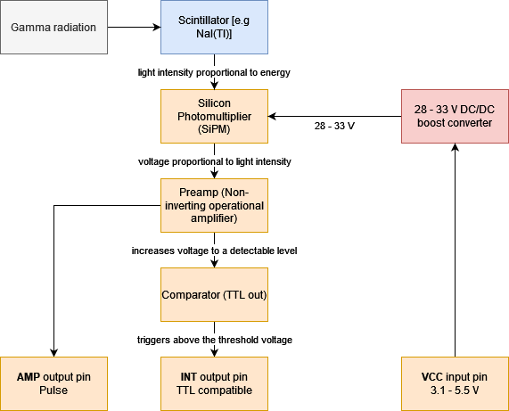

# Mini SiPM Driver (SiD) Board

__This project is on [Hackaday.io](https://hackaday.io/project/188090-mini-sipm-driver-board), where I also post project logs, progress updates and other announcements.__

Minimalistic board that allows you to quickly and easily utilize a silicon photomultiplier (SiPM) within your other projects. Supports a range of input voltages, has a digital (TTL) pulse output for the registered counts and a direct output for the amplified pulses to include some kind of peak detection for gamma spectroscopy. Somewhat based on the original [Open Gamma Detector](https://github.com/Open-Gamma-Project/Open-Gamma-Detector).

All you need to build your own scintillation counter is this board, a scintillator and SiPM. The benefits of such a scintillation counter are that you can use it just like a Geiger counter, but it's much more sensitive, smaller, doesn't need 300+ Volts and you can also use it to do spectroscopy beyond the scope of this board. It only registers gamma radiation though, so keep that in mind!

Hardware design has been done with [EasyEDA](https://easyeda.com/) and all the needed files for you to import the project as well as the schematic can be found in the `hardware` folder. There is also a Gerber file available for you to go directly to the PCB manufacturing step.

**-->** For quick access and purchase of all the parts (PCB and BOM) you can use [Kitspace](https://kitspace.org/boards/github.com/Open-Gamma-Project/Mini-SiD/). In addition, you'll also need to buy a SiPM (e.g. the MICROFC-60035-SMT-TR1) at a distributor of your choice. You'll also need a scintillator crystal of course. The MicroFC SiPM works best with NaI(Tl) scintillators.

  

  

## Specifications

Here are some of the most important key facts:

* Compact design: Total size 100 x 25 mm. 57 x 25 mm area for electronics and additional 43 x 25 mm to mount a small scintillator.
* Low-voltage device: No HV needed for a photomultiplier tube.
* SiPM voltage range from 28 V to 33 V.
* Low power consumption: ~12 mA @ 5V in standard operation.
* Adjustable preamp gain for the SiPM pulses (affects minimum detectable energy).
* TTL output for counting pulses or time-over-threshold applications.
* Additional pulse output if you want to manipulate the signal or use it for spectroscopy.
* Maximum cps only really limited by the speed of the scintillator.
* Only needs an additional microcontroller to work as a simple scintillation counter.

## Working Principle

  

## Hardware

This project utilizes a silicon photomultiplier (short SiPM) which is way smaller and more robust than a traditional photomultiplier tube and does not need a high-voltage supply (traditionally ~1000 V). Here are some very helpful in-depth datasheets about the particular MicroFC SiPM used here:

* [C-Series SiPM Sensors datasheet](https://www.onsemi.com/pdf/datasheet/microc-series-d.pdf)
* [Linearity of the Silicon Photomultiplier](https://www.onsemi.com/pub/Collateral/AND9776-D.PDF)
* [Introduction to the SiliconPhotomultiplier (SiPM)](https://www.onsemi.com/pub/Collateral/AND9770-D.PDF)
* [Biasing and Readout of ON Semiconductor SiPM Sensors](https://www.onsemi.com/pub/Collateral/AND9782-D.PDF)

Size is about 10 x 2.5 cm. If you don't need the additional space to mechanically mount the SiPM/scintillator assembly to the rest of the detector board, you can just cut it off at the white line and you're left with a much smaller detector (~5.7 x 2.5 cm).

This PCB is single-sided and only uses 0805 components or comparable IC packages to make it much easier to solder it by hand or buy it cheaply online.

The TTL-compatible `INT` output is an active low pin!

**Here is a helpful image about the potentiometer settings for Rev. 2.0/b:**

<em style="color:red">wip</em>

### Scintillator Assembly

The finished [MicroFC-](https://github.com/Open-Gamma-Project/MicroFC-SiPM-Carrier-Board) and [AFBR-](https://github.com/Open-Gamma-Project/AFBR-SiPM-Carrier-Board) SiPM carrier boards are there to allow for easier packaging with the scintillator as well as to be reusable for different detectors as that's by far the single most expensive part and you'll want to use it as long as possible. You should apply some optical coupling compound between the SiPM and the crystal window to reduce reflections as good as possible (this way the best photon detection efficiency is achieved). There are also special materials for this use case but you can also use standard silicone grease - works great for me. After you applied some, you press both parts together and wrap everything with light-tight tape, again, I'm just using some black electrical tape here. That's essentially it, now you can solder some wires to the pads on the board to connect them together and secure it in place in the free space on the board. There are holes on each side of the PCB for some cable ties.

I got all of my scintillators (used NaI(Tl), LYSO, ...) on eBay. Just search for some keywords or specific types, you'll probably find something! Otherwise you can obviously also buy brand-new scintillators, however, these are much more expensive (depends, but a factor of 10x is normal). Just be sure to look out for signs of wear and tear like scratches on the window or yellowing (!) in NaI crystals as these can deteriorate performance significantly.

### Shielding

Due to the detector measuring small voltages and (subsequent, if you want) energy resolution being limited by noise, the Mini SiD is generally pretty sensitive to EMI. If you turn up the preamp gain to the absolute maximum, you'll lose any energy resolution (which might be irrelevant to you), but the comparator will work more reliably to trigger on pulses with even more noise. Make sure to not saturate the comparator output so that it stays on completely, though.

For the best performance, you will need to put your detector into a metal enclosure. It doesn't need to be a thick metal case, a tin can will most likely suffice.

## Example Results

Here is a small collection of example results I got when measuring with my small 18 x 30 mm scintillator and a 6 mm MicroFC SiPM.

| Sample | Result Average [cps] |
| --- | --- |
| Background | 24 |
| Ionization Smoke Detector | 230 |
| Cup with Uraninite glaze | 64 |
| 5g LYSO scintillator | 34 |

## Some Ideas

### Coincidence Measurements

You can tie multiple boards' `INT` outputs together in an `AND` gate chip to only trigger a signal when all boards detected something. These AND gate ICs are very cheap, readily available and the last output can then go into a microcontroller interrupt pin to count the gamma events.

To make the timing a bit easier for the gates and to consider delays, you can feed the board `INT` output into a [monostable multivibrator circuit](https://en.wikipedia.org/wiki/Multivibrator#Monostable) such as an NE555 timer IC. This will allow you to stretch all the signals by a certain time factor.

### Cooling the SiPM

During operation all the electronics including the photomultiplier naturally heat up ever so slightly. Due to the detector board being connected to the SiPM only by a single pin connector and/or by touching the PCB, its heat shouldn't affect the SiPM much if at all. Air or water cooling alone won't improve performance considerably, because it won't heat up much above ambient temps. However, you could cool the SiPM PCB with a Peltier module to sub-ambient temperatures. According to the [datasheet AND9770 (Figure 27)](https://www.onsemi.com/pub/Collateral/AND9770-D.PDF) every 10°C reduction in temperature decreases the dark count rate by 50%! But be sure to correct the SiPM voltage (overvoltage) in this case as it also changes with temperature.

Note that the required breakdown voltage of the SiPM increases linearly with 21.5 mV/°C, see the [C-Series SiPM Sensors Datasheet](https://www.onsemi.com/pdf/datasheet/microc-series-d.pdf). This means that you would also need to temperature correct the PSU voltage if you wanted to use it with considerably different temperatures.

### Shielding Background Radiation

Shielding the ambient background can be done ideally using a wide enough layer of lead (bricks) all around the detector with a thin layer of lower-Z material on the inside (to avoid backscattering) such as copper. The SiPM and the sample can then be put into the structure to get the best measurements possible (low background).

See Wikipedia: [Lead Castle](https://en.wikipedia.org/w/index.php?title=Lead_castle&oldid=991799816)

---

Thanks for reading.
