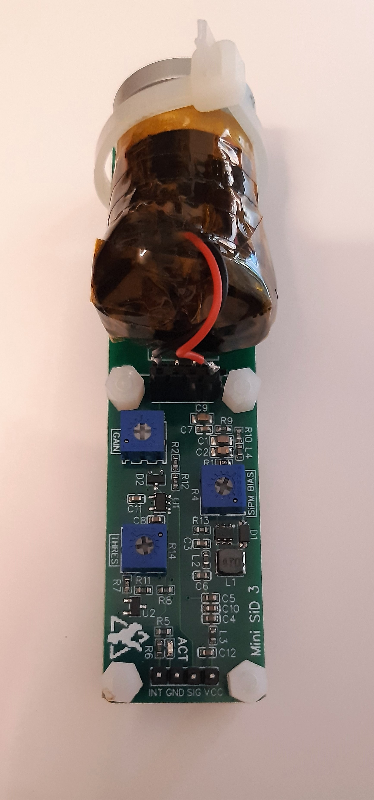
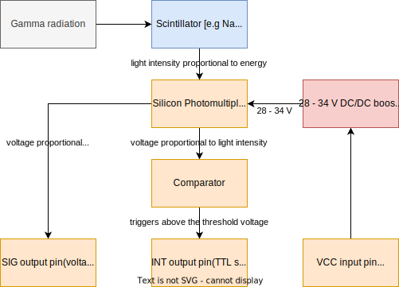
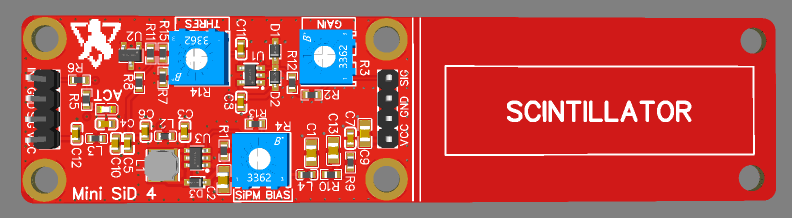
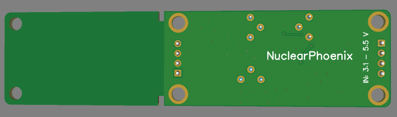
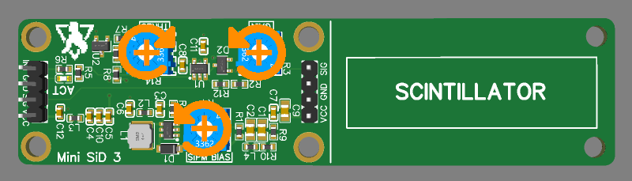
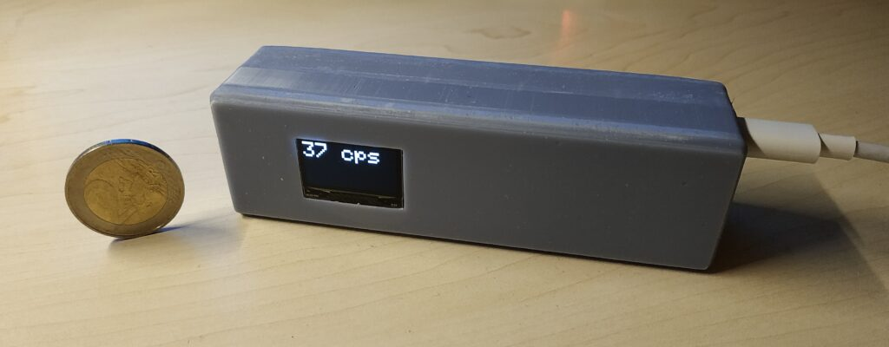

# Mini SiPM Driver (SiD) Board

**This is the latest hardware revision 4.x. For older revisions, please have a look at the [other branches](https://github.com/OpenGammaProject/Mini-SiD/branches). A comparison between the revision 3 and 4 hardware can be found [here on Hackaday](https://hackaday.io/project/188090-mini-sipm-driver-board/log/225429-revision-4-is-finally-here).**

**This project is on [Hackaday.io](https://hackaday.io/project/188090-mini-sipm-driver-board), where I also post project logs, progress updates and other announcements.**

Minimalistic board that allows you to quickly and easily utilize a silicon photomultiplier (SiPM) within your other projects. Supports a range of input voltages, has a digital (TTL) pulse output for the registered counts and a direct output for the SiPM pulses for easy expansion. Similar to the original [Open Gamma Detector](https://github.com/OpenGammaProject/Open-Gamma-Detector), but without any direct way to perform gamma spectroscopy.

  
  

All you need to build your own scintillation counter is this board, a scintillator and SiPM. The benefits of such a scintillation counter are that you can use it just like a Geiger counter, but it's much more sensitive, can be smaller, doesn't need 300+ Volts and you can also use it to do spectroscopy with some additional components. It mostly only registers gamma radiation though, so keep that in mind!

## How To Get One

* For quick access and purchase of all the parts (PCB and BOM), you can use [Kitspace](https://kitspace.org/boards/github.com/OpenGammaProject/Mini-SiD/) (non-affiliated).
* Otherwise, use a PCB manufacturer and an electronics distributor of your choice and proceed on your own. All the files you'll need can be found in this repo.
* If you don't want to deal with all of that, feel free to contact me. Just send me an e-mail if you want and we'll figure something out.

**You will also need to buy a SiPM (e.g. the MICROFC-60035-SMT-TR) and scintillator (NaI(Tl) recommended) separately at a distributor of your choice.**

## Specifications

Here are some of the most important key facts:

* Compact design: Total size 100 x 25 mm. 50 x 25 mm area for electronics and additional 50 x 25 mm to mount a small scintillator.
* Input voltage: 3.1 V - 5.5 V.
* Low-voltage device: No HV needed like with a photomultiplier tube.
* SiPM voltage range from 27.5 V to 33.8 V.
* Low power consumption: <4 mA @ 5 V in standard operation.
* Adjustable gain for the SiPM pulses, also affects pulse decay time and therefore dead time.
* TTL output for counting pulses or time-over-threshold applications.
* Additional raw pulse output if you want to manipulate the signal or use it for spectroscopy.
* Dead time only limited by the speed of the scintillator and the gain. Typically only a few microseconds.
* Only needs an additional cheap microcontroller to, for example, build a simple scintillation counter.

## Working Principle

Here is a nice flow chart explaining how this device roughly works:

## Hardware

Hardware design has been done with [EasyEDA](https://easyeda.com/) and all the needed files for you to import the project as well as the schematic can be found in the `hardware` folder. There is also a Gerber file available for you to go directly to the PCB manufacturing step.

This project utilizes a silicon photomultiplier (short SiPM) which is way smaller and more robust than a traditional photomultiplier tube and does not need a high-voltage supply (traditionally  around 1000 V). Here are some very helpful in-depth datasheets about the particular MicroFC SiPM used here:

* [C-Series SiPM Sensors datasheet](https://www.onsemi.com/pdf/datasheet/microc-series-d.pdf)
* [Linearity of the Silicon Photomultiplier](https://www.onsemi.com/pub/Collateral/AND9776-D.PDF)
* [Introduction to the SiliconPhotomultiplier (SiPM)](https://www.onsemi.com/pub/Collateral/AND9770-D.PDF)
* [Biasing and Readout of ON Semiconductor SiPM Sensors](https://www.onsemi.com/pub/Collateral/AND9782-D.PDF)

PCB size is 10 x 2.5 cm. If you don't need the additional space to mechanically mount the SiPM/scintillator assembly to the rest of the detector board, you can just cut it off at the white line and you're left with a much smaller detector (~5.0 x 2.5 cm).

The PCB has four layers with components only at the top side. It mostly uses 0603 components or comparable IC packages to make it possible to solder it by hand and at the same time keep it as small as reasonable.
This combination makes for the best signal properties while still being fairly affordable with today's PCB manufacturing prices.

The TTL-compatible `INT` output is an active high pin!

**Here is a helpful image about the potentiometer settings (turning increases each setting):**

## 3D Model

If you want to design an enclosure for the PCB or you need a 3D model for whatever other reason, you can have a look at the files in the `3D` folder. It includes 3D models of the PCB itself and some of the components on the board.

## Scintillation Counter

A great project utilizing the Mini SiD is building a scintillation counter, which can be much more powerful than a geiger counter while being safer to use, because of the relatively low voltages.

One great example build has been done by [RD-Gamma](https://rd-gammaspectra.xyz), who built one such device using a russian scintillator and a Broadcom AFBR SiPM.

## Example Results

Here is a small collection of example results I got when measuring the count rate at the TTL output with my small 18 x 30 mm NaI(Tl) scintillator and a 6 mm MicroFC SiPM.

| Sample | Result Average [cps] |
| --- | --- |
| Background (no source) | 24 |
| Am-241 (commonly used in ionization smoke detectors) | 230 |
| Cup with Uraninite glaze (i.e. containing natural pitchblende) | 64 |
| 5g LYSO scintillator (containing naturally-occuring Lu-176) | 34 |
| Thorianite (mineral) | 800 |

## Some Ideas

### Coincidence Measurements

You can tie multiple boards' `INT` outputs together in an `AND` gate chip to only trigger a signal when all boards detected something. These AND gate ICs are very cheap, readily available and the output can then go into a microcontroller interrupt pin to count the gamma events.

To make the timing a bit easier for the gates and to consider delays, you can feed the board `INT` output into a [monostable multivibrator circuit](https://en.wikipedia.org/wiki/Multivibrator#Monostable) such as an NE555 timer IC. This will allow you to stretch all the signals by a certain time factor you can set.

---

Thanks for reading.
